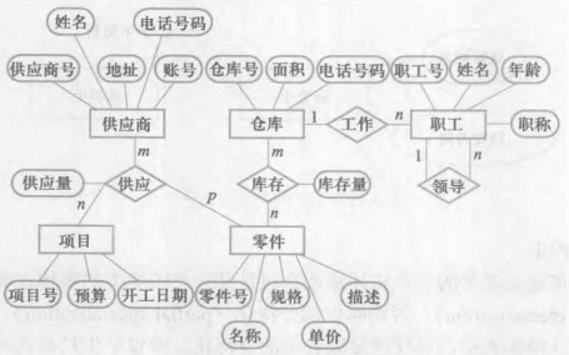
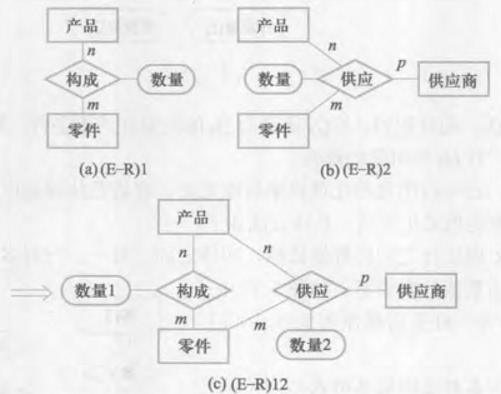

# Entity-Relationship Model
[Wikipedia](https://en.wikipedia.org/wiki/Entity%E2%80%93relationship_model)

E-R 模型是用 E-R 图来描述现实世界的概念模型。

## Entity
客观存在且可相互区别的事物称为实体。

用实体名及其属性名集合来抽象和刻画同类实体，称为实体型。

同一类型实体的集合称为实体集。

## Attribute
实体所具有的某一特性称为属性。

唯一标识实体的属性集称为码。

## Relationship
包括实体/实体型内部和相互之间的联系。

实体内部的联系通常是指组成实体的各属性之间的联系，实体之间的联系通常是指不同实体集之间的联系。

## E-R 图
E-R 提供了表示实体型、属性和联系的方法。
- 矩形：实体型
- 椭圆形：属性
- 联系：菱形

  
“每个职工工作在 1 个仓库，每个仓库有 n 个职工工作”

## 概念结构设计
- 对收集到的需求信息进行分类、组织，确定实体、属性和联系，形成 E-R 图。
- 为简化模型，能作为属性的事物尽量作为属性对待。

E-R 图集成：
- 合并
  - 属性冲突

    例如有的部门用出生日期表示年龄，而有的用整数表示。

  - 命名冲突
    - 同名异义：不同对象在不同局部应用中具有相同名称
    - 异名同义：相同对象在不同局部应用中具有不同名称

  - 结构冲突
    - 同一对象在不同应用中具有不同抽象
    - 同一实体在不同应用中包含的属性个数和顺序不同
    - 相同实体间的联系在不同应用中不同

- 修改和重构

  消除冗余数据和联系

  方法：
  - 分析
  - 关系范式

