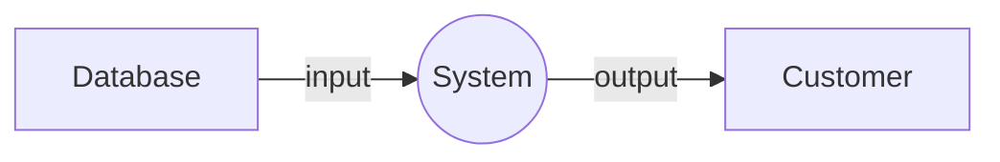

# Data-flow Diagrams
[Wikipedia](https://en.wikipedia.org/wiki/Data-flow_diagram)

Mermaid: [Data Flow Diagram (a la STRIDE Threat Model) - Issue #1893 - mermaid-js/mermaid](https://github.com/mermaid-js/mermaid/issues/1893)