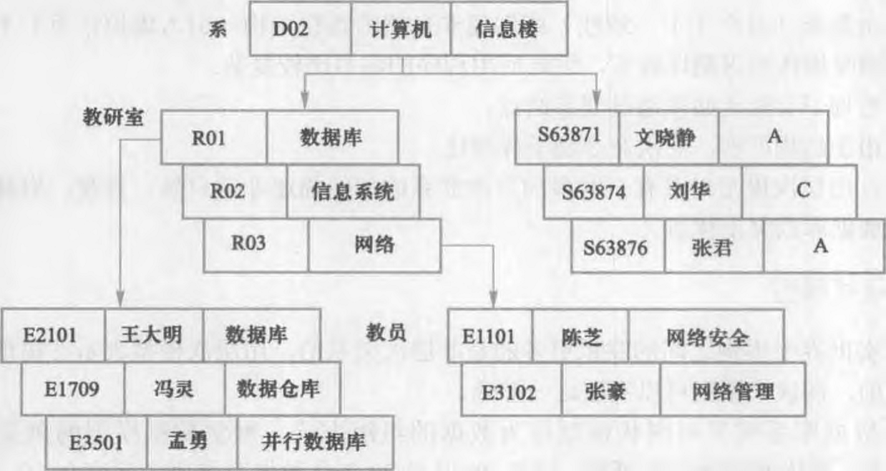

# Network Databases
## Network model
[Wikipedia](https://en.wikipedia.org/wiki/Network_model)

The **network model** is a database model conceived as a flexible way of representing objects and their relationships. Its distinguishing feature is that the schema, viewed as a graph in which object types are nodes and relationship types are arcs, is not restricted to being a hierarchy or lattice.

