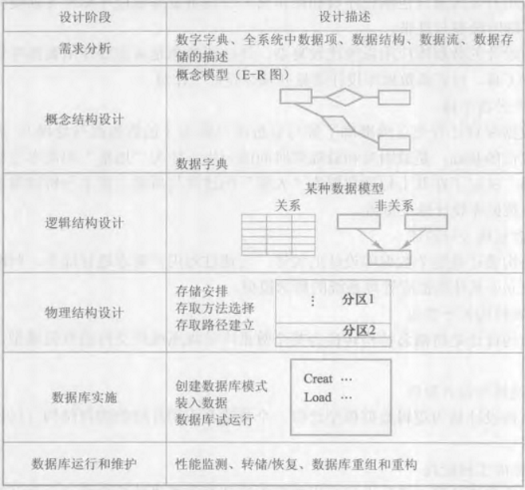

# Databases
[Wikipedia](https://en.wikipedia.org/wiki/Database)

数据：描述事物的符号记录

数据库：长期储存在计算机内的、有组织的、可共享的大量数据的集合

数据库管理系统：位于用户与操作系统之间的一层数据管理软件

数据库系统：由数据库、数据库管理系统（及其应用开发工具）、应用程序和数据库管理员（DBA）组成的存储、管理、处理和维护数据的系统

Books:
- 《数据库系统概论》王珊
  - [数据库四章课后练习笔记 | 码农家园](https://www.codenong.com/cs105667317/)

Courses:
- [CMU 15-445/645 :: Intro to Database Systems (Fall 2019)](https://15445.courses.cs.cmu.edu/fall2019/)

## 数据库
数据库是长期储存在计算机内的、有组织的、可共享的大量数据的集合。数据库中的数据按一定的数据模型组织、描述和储存，具有较小的冗余度、较高的数据独立性和易扩展性，并可为各种用户共享。

## 数据库管理系统
主要功能：
- 数据定义功能

  数据定义语言（DDL）

- 数据组织、存储和管理

- 数据操纵功能

  数据操纵语言（DML）

- 数据库的事务管理和运行管理

- 数据库的建立和维护

- 其它

### Comparison
[DB-Engines Ranking - popularity ranking of database management systems](https://db-engines.com/en/ranking)

[SQL Server 和 Oracle 以及 MySQL 有哪些区别？ - 知乎](https://www.zhihu.com/question/19866767)

[SQL Server 相比 MySQL 有何优势？ - 知乎](https://www.zhihu.com/question/57423097)

[CaryHsu - 學無止盡: 不同資料庫的比較 - SQL Server vs Oracle and MySQL](http://caryhsu.blogspot.com/2011/06/sql-server-vs-oracle-and-mysql.html) 2011年

[数据量较大，数据库选型问题 - V2EX](https://www.v2ex.com/t/1007852)

## 数据库系统
特点：
- 数据结构化
- 数据的共享性高、冗余度低且易扩充
- 数据独立性高
  - 物理独立性：用户的应用程序与数据库中数据的物理存储是相互独立的
  - 逻辑独立性：用户的应用程序与数据库的逻辑结构是相互独立的

  数据独立性是由数据库管理系统提供的二级映像功能来保证的

- 数据由数据库管理系统统一管理和控制
  - 数据的安全性保护
  - 数据的完整性保护
  - 并发控制
  - 数据库恢复

## 数据库设计
“数据库设计是指对于一个给定的应用环境，构造（设计）优化的数据库逻辑模式和物理结构，并据此建立数据库及其应用系统，使之能够有效地存储和管理数据，满足各种用户的应用需求，包括信息管理要求和数据操作要求。”

### 设计步骤

### 模式设计
