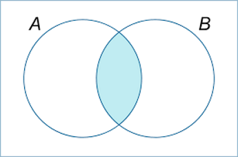

# Joins
[Wikipedia](https://en.wikipedia.org/wiki/Join_(SQL))

A join clause in SQL – corresponding to a join operation in relational algebra – combines columns from one or more tables into a new table.

## 分类
- Cross join
- Inner join
  - Equi-join
    - Natural join
- Outer join
  - Left outer join
  - Right outer join
  - Full outer join
- Self join

## Cross join
`CROSS JOIN` returns the Cartesian product of rows from tables in the join.

Explicit cross join:
```sql
SELECT *
FROM employee CROSS JOIN department;
```

Implicit cross join:
```sql
SELECT *
FROM employee, department;
```

The cross join can be replaced with an inner join with an always-true condition:
```sql
SELECT *
FROM employee INNER JOIN department ON 1=1;
```

## Inner join


An inner join requires each row in the two joined tables to have matching column values, and is a commonly used join operation in applications but should not be assumed to be the best choice in all situations.

Explicit inner join:
```sql
SELECT employee.LastName, employee.DepartmentID, department.DepartmentName 
FROM employee 
[INNER] JOIN department ON
employee.DepartmentID = department.DepartmentID;
```

Implicit inner join:
```sql
SELECT employee.LastName, employee.DepartmentID, department.DepartmentName 
FROM employee, department
WHERE employee.DepartmentID = department.DepartmentID;
```
（cross join + `WHERE`）

## Equi-join
An equi-join is a specific type of comparator-based join, that uses only equality comparisons in the join-predicate.

By explicit inner join:
```sql
SELECT *
FROM employee JOIN department
  ON employee.DepartmentID = department.DepartmentID;
```

By implicit inner join:
```sql
SELECT *
FROM employee, department
WHERE employee.DepartmentID = department.DepartmentID;
```

If columns in an equi-join have the same name, SQL-92 provides an optional shorthand notation for expressing equi-joins, by way of the USING construct:
```sql
SELECT *
FROM employee INNER JOIN department USING (DepartmentID);
```
不同的是，使用 `USING` 时只会得到一个 `DepartmentID` 列，而不是两个。

## Natural join
The natural join is a special case of equi-join. Natural join ($\bowtie$) is a binary operator that is written as ($R\bowtie S$) where $R$ and $S$ are relations. The result of the natural join is the set of all combinations of tuples in R and S that are equal on their common attribute names.

```sql
SELECT *
FROM employee NATURAL JOIN department;
```

## Outer join
The joined table retains each row—even if no other matching row exists.

Left outer join:


The result of a left outer join (or simply left join) for tables A and B always contains all rows of the "left" table (A), even if the join-condition does not find any matching row in the "right" table (B).

```sql
SELECT *
FROM employee 
LEFT OUTER JOIN department ON employee.DepartmentID = department.DepartmentID;
```

Right outer join:
```sql
SELECT *
FROM employee RIGHT OUTER JOIN department
  ON employee.DepartmentID = department.DepartmentID;
```

Full outer join:
```sql
SELECT *
FROM employee FULL OUTER JOIN department
  ON employee.DepartmentID = department.DepartmentID;
```

## Self join
A self-join is joining a table to itself.

To find employees having the same country:
```sql
SELECT F.EmployeeID, F.LastName, S.EmployeeID, S.LastName, F.Country
FROM Employee F INNER JOIN Employee S ON F.Country = S.Country
WHERE F.EmployeeID < S.EmployeeID
ORDER BY F.EmployeeID, S.EmployeeID;
```


