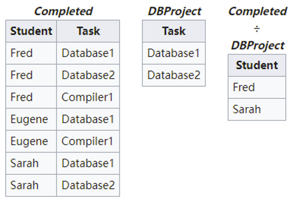

# Relational Algebra
[Wikipedia](https://en.wikipedia.org/wiki/Relational_algebra)

- $\sigma$ Selection
- $\Pi$ Projection
- $\bowtie$ Join
- $\div$ Division

## Selection
选取元组。

查询至少选修了两门课程的学生（$SC(Sno, Cno, Grade)$）：
$$\sigma_{[1]=[4]∧[2]≠[5]}(SC×SC)$$

## Projection
选取属性组。

还要消除结果中的重复行。

## Image sets
“A 中 X 分量等于 x 的元组集合在属性集 Z 上的投影（不包括 X 分量）。”

[数据库中什么叫象集 - yuanqi - 博客园](https://www.cnblogs.com/yuanqi/p/4589947.html)
> 如A：  
> X | Y | Z
> --- | --- | ---
> a1 | b1 | c2
> a2 | b3 | c7
> a3 | b4 | c6
> a1 | b2 | c3
> a4 | b6 | c6
> a2 | b2 | c3
> a1 | b2 | c1
> 
> a1在A中的象集为 ${(b1,c2),(b2,c3),(b2,c1)}$

## Join
$$
R \underset{A\theta B}\bowtie S
= \set{\overset{\frown}{t_r t_s} | t_r \in R \land t_s\in S \land t_r[A] \theta t_S[B]}
$$

- 等值连接（equijoin）

  $$A=B$$

- 自然连接（natural join）

  自然连接是一种特殊的等值连接。

  在结果中把进行比较的两个重复属性去掉一个。

- 外连接（outer join）

  保留悬浮元组（dangling tuple）（自然连接失败的元组）。
  - 外连接
  - 左外连接
  - 右外连接

## Division
$$
R \div S
=\set{ t_r[X] | t_r\in R \land \Pi_Y(S) \subseteq Y_X }
$$
“元组在 $X$ 上的分量值的   包含 $S$ 在 $Y$ 上投影   的象集 $Y_x$   的集合”

象集包含指定元组。

$$
R \div S
=\set{ t[a_1,\cdots,a_n] : t \in R \land \forall s \in S ((t[a_1,\cdots,a_n] \cup s) \in R) }
$$



查询选修了所有课程的学生：
```sql
SELECT Sname
FROM Student
WHERE NOT EXISTS
    (SELECT *
    FROM Course
    WHERE NOT EXISTS
        (SELECT *
        FROM SC
        WHERE Sno=Student.Sno
AND Cno=Course.Cno));
```
不存在（不存在他选修了这个课程）=全称（他选修了这个课程）

$$R\div S = \Pi_x(R) - \Pi_x((\Pi_x(R) \times S) - R)$$
```sql
SELECT * FROM R 
WHERE x not in ( SELECT x FROM (
(SELECT x , y FROM (select y from S ) as p cross join 
(select distinct x from R) as sp)
EXCEPT
(SELECT x , y FROM R) ) AS r );
```
```sql
SELECT * FROM R as sx
WHERE NOT EXISTS (
(SELECT p.y FROM S as p )
EXCEPT
(SELECT sp.y FROM  R as sp WHERE sp.x = sx.x ) );
```
[SQL | DIVISION - GeeksforGeeks](https://www.geeksforgeeks.org/sql-division/)