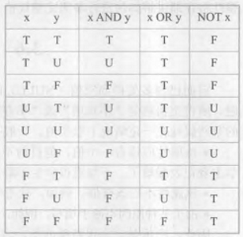

# Null
[Wikipedia](https://en.wikipedia.org/wiki/Null_(SQL))

属性取空值一般有以下几种情况：
- 该属性应该有一个值，但目前不知道它的具体值。
- 该属性不应该有值。
- 由于某种原因不便于填写。

 

- 使用 `IS NULL` 判断 `NULL`
- 对 `NULL` 做算术运算的结果为 `NULL`
- 对 `NULL` 做比较运算的结果为 `UNKNOWN`
- 对 `UNKNOWN` 做逻辑运算：

  

  `WHERE` 和 `HAVING` 只使用运算结果为 `TRUE` 的元组

  - NOT U = U
  - U AND T = U
  - U AND F = F
  - U AND U = U
  - U OR T = T
  - U OR F = U
  - U OR U = U