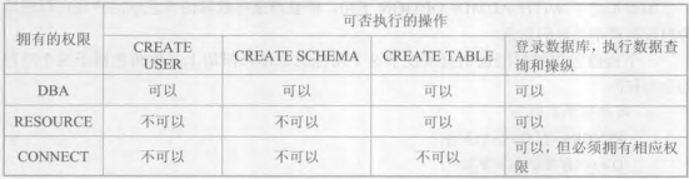

# Discretionary Access Control
C2 级

在 DAC 中，用户对于不同数据库对象有不同存取权限，不同用户对同一对象也有不同权限，用户还可将存取权限转授给其它用户，非常灵活。

- ```sql
  CREATE USER 用户名 [WITH <DBA | RESOURCE | CONNECT>]
  ```
  （非 SQL 标准）

  

  `PUBLIC` 为所有用户

- ```sql
  CREATE ROLE 角色名
  ```

<br />

- 权限

  `SELECT | INSERT | UPDATE | DELETE | REFERENCES | ALL PRIVILEGES`
- ```sql
  GRANT <权限[(属性列, …)], …>
  ON <对象类型 对象名, …>
  TO <用户, …>
  [WITH GRANT OPTION]
  |
  GRANT <角色, …>
  TO <用户|角色, …>
  [WITH ADMIN OPTION]
  ```
- ```sql
  REVOKE <权限, …>
  [ON <对象类型 对象名, …>]
  FROM <用户|角色, …> [CASCADE|RESTRICT]
  ```