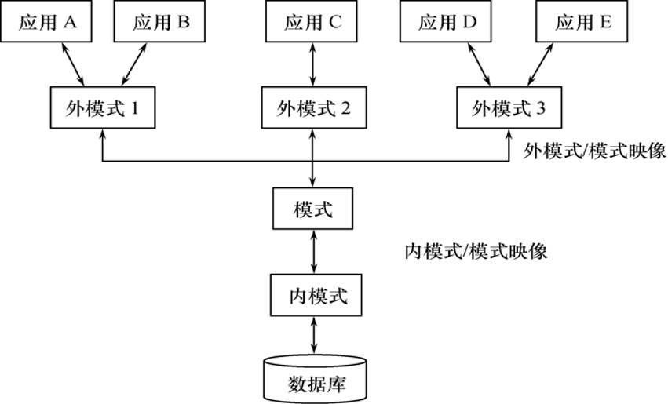

# Three-schema Approach
[Wikipedia](https://en.wikipedia.org/wiki/Three-schema_approach)

## 内模式（Internal schema）
“内模式也称存储模式（storage schema），一个数据库只有一个内模式。它是数据物理结构和存储方式的描述，是数据在数据库内部的组织方式。例如，记录的存储方式是堆存储还是按照某个（些）属性值的升（降）序存储，或按照属性值聚簇（cluster）存储：索引按照什么方式组织，是 B+ 树索引还是 hash 索引；数据是否压缩存储，是否加密；数据的存储记录结构有何规定，如定长结构或变长结构，一个记录不能跨物理页存储；等等。”

## 模式/内模式映像
模式/内模式映像是唯一的。

## 模式（Schema）
“模式也称逻辑模式，是数据库中全体数据的逻辑结构和特征的描述，是所有用户的公共数据视图。定义模式时不仅要定义数据的逻辑结构，例如数据记录由哪些数据项构成，数据项的名字、类型、取值范围等；而且要定义数据之间的联系，定义与数据有关的安全性、完整性要求。”

## 外模式/模式映像

## 外模式（External schema）
“外模式也称子模式（subschema）或用户模式，它是数据库用户能够看见和使用的局部数据的逻辑结构和特征的描述，是数据库用户的数据视图，是与某一应用有关的数据的逻辑表示。”