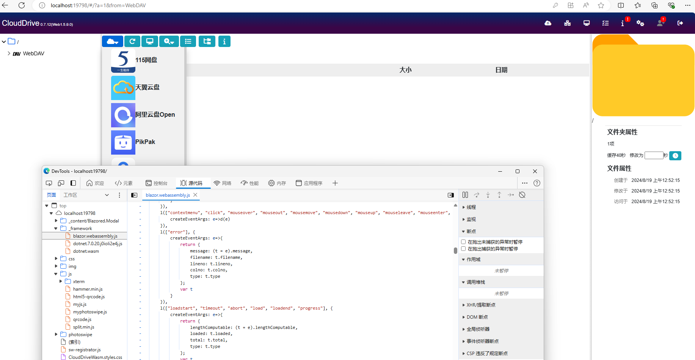

# File Systems
- [Apache OpenDAL: One Layer, All Storage.](https://github.com/apache/opendal)

- [rust-vfs: A virtual filesystem for Rust](https://github.com/manuel-woelker/rust-vfs)

- [Spacedrive: An open source cross-platform file explorer, powered by a virtual distributed filesystem written in Rust.](https://github.com/spacedriveapp/spacedrive)

- [remotefs-rs: ⏫ A client library to work with all file transfer protocols ⏬](https://github.com/remotefs-rs/remotefs-rs)

- [CloudDrive：一个强大的多云盘管理工具，为用户提供包含云盘本地挂载的一站式的多云盘解决方案](https://www.clouddrive2.com/)
  - [跨云盘文件快速复制](https://www.clouddrive2.com/features.html#inter-cloud-copy)
  - 详细介绍至少有部分是 AI 生成的
  - Web UI 比较丑，不过居然是 Blazor 写的
 
    
  - 后端是 Rust 写的
  - > Everything 1.5 和 1.4 都无法在添加索引后正常完成扫描，但是 1.5 重启后显示索引到了部分文件，1.4 则似乎可以索引到大部分文件。使用 Everything 进行索引时有概率导致文件管理应用卡死，或者导致驱动器无法正常访问，返回 `Os { code: 50, kind: Uncategorized, message: "不支持该请求。" }`，卸载驱动器后无法再次正常挂载。Listary 也有一定概率能索引到文件夹，但没有索引到过文件。推测是特定访问模式会引发 CloudDrive2 不加载文件夹内容、卡死或崩溃。CloudDrive2 的后端是 Rust 写的，可能是出现了 panic 导致工作线程退出。总之至少一部分问题是 CloudDrive2 自身导致的。

- [File Storage API - One single API to build File Storage integrations](https://www.apideck.com/file-storage-api) (paid)
  - [file-picker-js: Apideck FilePicker Modal for JavaScript projects](https://github.com/apideck-libraries/file-picker-js)
