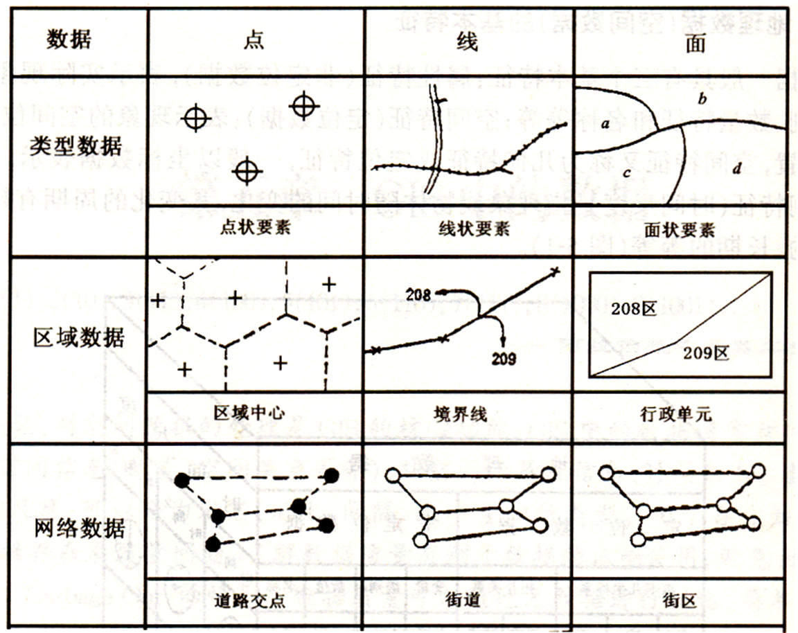
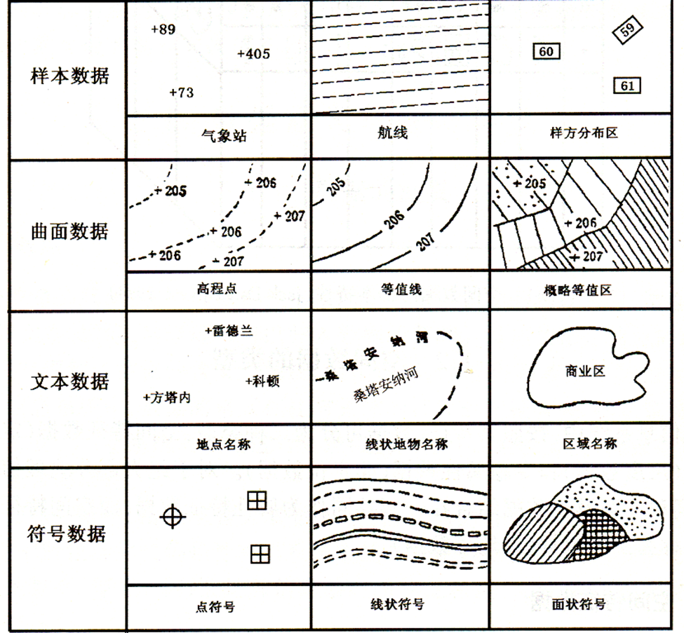

# Geographic Data
GIS 中主要有以下几种类型的空间数据：
- 地图数据

  来源于各种类型的普通地图和专题地图，这些地图的内容丰富，图上实体间的空间关系直观，实体的类别或属性清晰，实测地形图还具有很高的精度。
- 影像数据

  主要来源于卫星遥感和航空遥感，包括多平台、多层面、多种传感器、多时相、多光谱、多角度和多种分辨率的遥感影像数据，构成多源海量数据，也是 GIS 的最有效的数据源之一。
- 地形数据

  来源于地形等高线图的数字化，已建立的数字高程模型（DEM）和其他实测的地形数据等。
- 属性数据

  来源于各类调查报告、实测数据、文献资料、解译信息等。
- 元数据

  来源于由各类纯数据通过调查、推理、分析和总结得到的有关数据的数据，例如数据来源、数据权属、数据产生的时间、数据精度、数据分辨率、源数据比例尺、数据转换方法等。
- 其它

  如全球卫星定位系统实时定位数据，也是重要的数据来源之一。

这些数据可以归为以下几种类型：

   

- 类型数据：例如考古地点、道路线和土壤类型的分布等
- 区域数据：例如随机多边形的中心点、行政区域界线和行政单元等
- 网络数据：例如道路交点、街道和街区等
- 样本数据：例如气象站、航线和野外样方的分布区等
- 曲面数据：例如高程点、等高线和等值区域
- 文本数据：例如地名、河流名称和区域名称
- 符号数据：例如点状符号、线状符号和面状符号（晕线）等

## Data
- [USGS EarthExplorer](https://earthexplorer.usgs.gov/)

  虽然可以上传 KML 或 Shapefile 来选择区域，但一方面只支持单多边形，另一方面只支持 500 个顶点，很不好用。

  [Sentinel2 哨兵2数据下载方法（USGS）-史上最全讲解 - xiatiandexia123的博客](https://blog.csdn.net/xiatiandexia123/article/details/122095017)
- [ArcGIS Hub](https://hub.arcgis.com/)

DEMs[^gisgeography]:
- [Shuttle Radar Topography Mission (SRTM)](https://gisgeography.com/srtm-shuttle-radar-topography-mission/)

  [USGS Earth Explorer: Download Free Landsat Imagery](https://gisgeography.com/usgs-earth-explorer-download-free-landsat-imagery/)
- [ASTER Global Digital Elevation Map](https://asterweb.jpl.nasa.gov/gdem.asp)

  Despite its experimental grade, ASTER GDEM-2 is [considered a more accurate representation](http://www.tandfonline.com/doi/abs/10.1080/08120099.2014.884983?journalCode=taje20) than the SRTM elevation model in rugged mountainous terrain.
- [JAXA ALOS World 3D](https://www.eorc.jaxa.jp/ALOS/en/dataset/aw3d_e.htm)

  It is the **most precise global-scale elevation data** now.
- [OpenDEM](https://www.opendem.info/)

Population:
- [ORNL LandScan Viewer - Oak Ridge National Laboratory](https://landscan.ornl.gov/)

### 中国
- [#数据分享 - 学研录](https://mp.weixin.qq.com/mp/appmsgalbum?action=getalbum&album_id=1723894853249318919)
- [全球变化科学研究数据出版系统](http://geodoi.ac.cn/WebCn/CategoryList.aspx)
- [GIS数据 | 麻辣GIS](https://malagis.com/category/gis-resource/)

DEMs:
- [数据分享︱全国30 m分辨率DEM数据（ASTER GDEM V3、SRTM V3和NASA） - 学研录](https://mp.weixin.qq.com/s/tmOc7nMd5NgvTKN2beUBLQ)
- [中国数字高程图（1KM） - 国家青藏高原科学数据中心](https://data.tpdc.ac.cn/en/data/12e91073-0181-44bf-8308-c50e5bd9a734/)

行政区划：
- [DataV.GeoAtlas 地理小工具系列](https://datav.aliyun.com/portal/school/atlas/area_selector) (GeoJSON, GCS_WGS_1984)

  [想要找一个地级市的shp图，请问哪里能免费下载？ - 知乎](https://www.zhihu.com/question/360090480/answer/2315923129)
- [数据| 2021年7月中国省、市、县和乡镇级行政区划shp数据 - 学研录](https://mp.weixin.qq.com/s/S8gOxJdJmWZJ6zQQAyG1BQ) (Shapefile, GCS_WGS_1984)
- [「GIS数据」区县级行政区划数据-审图号：GS（2022）1873号 | 麻辣GIS](https://malagis.com/gis-data-district-and-county-level-gs-2022-1873.html)
- [POI数据 (poi86.com)](https://www.poi86.com/) (Shapefile)

  Missing spatial reference information.

Land value:
- [中国地价监测网](https://www.landvalue.com.cn/) (JSON-WKT)
  - 地价监测数据
    - 区段：`50622mdt/levelprice/GetRegions`
    - 监测点
  - 基准地价数据
    - 级别地价：`50622mdt/levelprice/GetLevelPrices`
    - 区片地价
    - 路线价
  - `50622mdt/STDLand/GetStdLands`

  大部分城市内的区域覆盖不全。

POI:
- [数据 | 全国范围2012、2014、2016、2018、2020年常用POI矢量数据集（shp) - 学研录](https://mp.weixin.qq.com/s/XnHM9BgHDWpFi_FOAgpQpw) (Shapefile, CGCS_2000)
- [POI数据 (poi86.com)](https://www.poi86.com/) (paid)
  - [lyBigdata/CN_POI_Data](https://github.com/lyBigdata/CN_POI_Data) (2017)
- [CnOpenData 全国兴趣点（POI）数据](https://www.cnopendata.com/data/m/regional.html/POI.html) (paid)
- [POILIST - 全国POI信息数据库](http://www.poilist.cn/) (paid)

Population:
- [数据 | 1990—2020年五套全球和我国人口密度数据集 - 学研录](https://mp.weixin.qq.com/s/sDxVf7hze576CXpfVsqr5g)

[^gisgeography]: [5 Free Global DEM Data Sources - Digital Elevation Models - GIS Geography](https://gisgeography.com/free-global-dem-data-sources/)