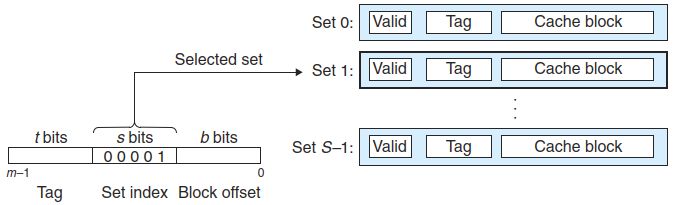
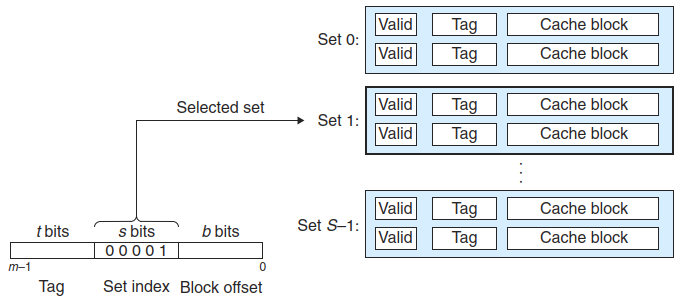
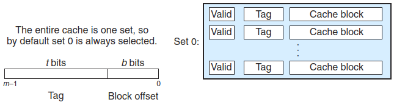

# Cache
A **cache** is organized as an array of $S$ cache sets. Each **set** consists of $E$ cache lines. Each **line** consists of a data **block** of $B$ bytes, a **valid bit** that indicates whether or not the line contains meaningful information, and $t=m-(b+s)$ **tag bits** (a subset of bits from the current block's memory address), where $m$ is the bits each memory address has. In general, a cache’s organization can be characterized by the tuple $(S, E, B, m)$. The size (or capacity) of a cache, $C$, is stated in terms of the aggregate size of all the blocks. The tag bits and valid bit are not included. Thus, $C = S \times E \times B$.[^csapp]

## Direct-mapped cache
A cache with exactly one line per set ($E = 1$) is known as a **direct-mapped cache** [^csapp]:

## Set associative cache
The problem with conflict misses in direct-mapped caches stems from the con- straint that each set has exactly one line (or in our terminology, $E = 1$). A **set associative cache** relaxes this constraint so that each set holds more than one cache line. A cache with $1 < E < {C\over B}$ is often called an E-way set associative cache.[^csapp]

Replacement policies:
- Random
- FIFO
- Least frequently used
- Least recently used

## Fully associative cache
A **fully associative cache** consists of a single set (i.e., $E = {C\over B}$) that contains all of the cache lines.

Because the cache circuitry must search for many matching tags in parallel, it is difficult and expensive to build an associative cache that is both large and fast. As a result, fully associative caches are only appropriate for small caches, such as the translation lookaside buffers (TLBs) in virtual memory systems that cache page table entries.[^csapp]

[^csapp]: Computer Systems：A Programmer's Perspective