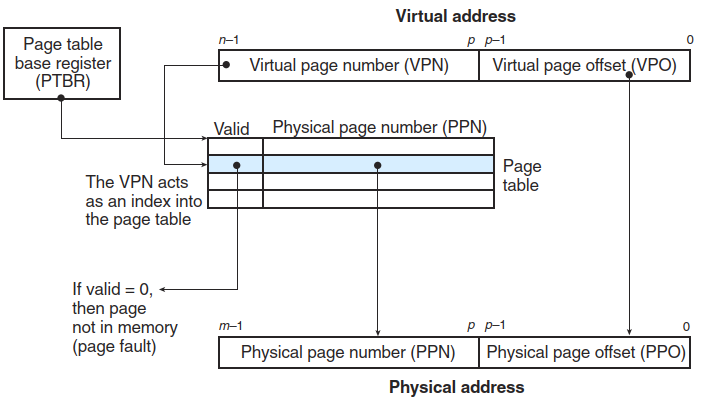

# Virtual memory
Goals[^three]:
- Transparency
- Efficiency
- Protection

Conceptually, a virtual memory is organized as an array of N contiguous byte-size cells stored on disk. The contents of the array on disk are cached in main memory. At any point in time, the set of virtual pages is partitioned into three disjoint subsets:
- Unallocated
- Cached
- Uncached

Because of the large miss penalty and the expense of accessing the first byte, virtual pages tend to be large—typically 4 KB to 2 MB. Due to the large miss penalty, DRAM caches are fully associative; that is, any virtual page can be placed in any physical page. The replacement policy on misses also assumes greater importance, because the penalty associated with replacing the wrong virtual page is so high. Thus, operating systems use much more sophisticated replacement algorithms for DRAM caches than the hardware does for SRAM caches. Finally, because of the large access time of disk, DRAM caches always use write-back instead of write-through.[^csapp]

## Address space
32-bit[^three]:
- User address space: 0~0xBFFFFFFF
- Kernel address space: 0xC0000000~0xFFFFFFFF
  - Kernel logical addresses
    
    Most kernel data structures live here, such as page tables, per-process kernel stacks, and so forth. Unlike most other memory in the system, kernel logical memory cannot be swapped to disk. Kernel logical addresses are allocated by calling `kmalloc`.

    There is a direct mapping between kernel logical addresses and the first portion of physical memory. This direct mapping has two implications:
    - The first is that it is simple to translate back and forth between kernel logical addresses and physical addresses; as a result, these addresses are often treated as if they are indeed physical.
    - The second is that if a chunk of memory is contiguous in kernel logical address space, it is also contiguous in physical memory. This makes memory allocated in this part of the kernel’s address space suitable for operations which need contiguous physical memory to work correctly, such as I/O transfers to and from devices via directory memory access (DMA).
  
  - Kernel virtual addresses

    Unlike kernel logical memory, kernel virtual memory is usually not contiguous; each kernel virtual page may map to non-contiguous physical pages (and is thus not suitable for DMA). However, such memory is easier to allocate as a result, and thus used for large buffers where finding a contiguous large chunk of physical memory would be challenging. Kernel virtual addresses are allocated by `vmalloc`.

The `pmap` command line tool can show what different mapping comprise the virtual address space of a running program.

## Address translation

A page table is an array of page table entries (PTEs). Each page in the virtual address space has a PTE at a fixed offset in the page table.

### Translation lookaside buffer
Every time the CPU generates a virtual address, the MMU must refer to a PTE in order to translate the virtual address into a physical address. In the worst case, this requires an additional fetch from memory, at a cost of tens to hundreds of cycles. If the PTE happens to be cached in L1, then the cost goes down to a handful of cycles. However, many systems try to eliminate even this cost by including a small cache of PTEs in the MMU called a **translation lookaside buffer (TLB)**.[^csapp]

A TLB is a small, virtually addressed cache where each line holds a block consisting of a single PTE.

### Multi-level page tables
Accessing k PTEs may seem expensive and impractical at first glance. However, the TLB comes to the rescue here by caching PTEs from the page tables at the different levels. In practice, address translation with multi-level page tables is not significantly slower than with single-level page tables.[^csapp]

### Large page support
When a process actively uses a large amount of memory, it quickly fills up the TLB with translations. If those translations are for 4-KB pages, only a small amount of total memory can be accessed without inducing TLB misses. The result, for modern “big memory” workloads running on machines with many GBs of memory, is a noticeable performance cost; recent research shows that some applications spend 10% of their cycles servicing TLB misses.

Huge pages allow a process to access a large tract of memory without TLB misses, by using fewer slots in the TLB, and thus is the main advantage. However, there are other benefits to huge pages: there is a shorter TLB-miss path, meaning that when a TLB miss does occur, it is serviced more quickly. In addition, allocation can be quite fast (in certain scenarios), a small but sometimes important benefit.

Huge pages are not without their costs. The biggest potential cost is internal fragmentation, i.e., a page that is large but sparsely used. Swapping, if enabled, also does not work well with huge pages, sometimes greatly amplifying the amount of I/O a system does. Overhead of allocation can also be bad (in some other cases).[^three]

## Page cache
The Linux page cache is unified, keeping pages in memory from three primary sources:
- Memory-mapped files
  
  File data and metadata from devices (usually accessed by directing `read()` and `write()` calls to the file system).

- Heap and stack pages that comprise each process (anonymous memory)

These entities are kept in a page cache hash table, allowing for quick lookup when said data is needed.

The page cache tracks if entries are clean (read but not updated) or dirty (a.k.a., modified). Dirty data is periodically written to the backing store (i.e., to a specific file for file data, or to swap space for anonymous regions) by background threads (called pdflush), thus ensuring that modified data eventually is written back to persistent storage. This background activity either takes place after a certain time period or if too many pages are considered dirty (both configurable parameters).

Linux uses a modified form of 2Q replacement to decide which pages to kick out of memory to free up space when the system runs low on memory.[^three]

## Security
[^three]
- NX bit (no-execute bit)

  NX bit prevents execution from any page which has this bit set in its corresponding page table entry.

- Address space layout randomization (ASLR)

  ASLR is used to defend against return-oriented programming.

- Kernel address space layout randomization (KASLR)

- Meltdown & Spectre

  Speculative execution tends to leave traces of its execution in various parts of the system, such as processor caches, branch predictors, etc. Such state can make vulnerable the contents of memory, even memory that we thought was protected by the MMU.

  - Kernel pagetable isolation (KPTI)

    KPTI removes as much of the kernel address space from each user process and instead have a separate kernel page table for most kernel data.  Doing so improves security and avoids some attack vectors, but at a cost: performance.

[^csapp]: Computer Systems：A Programmer's Perspective
[^three]: Operating Systems: Three Easy Pieces